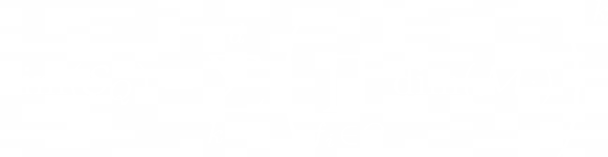

[English](README_en.md) | 中文 
# AdaptoFlux

**一种基于功能集（包含多种类型的函数的集合）实现智能的算法**

## 项目概述
AdaptoFlux是一种基于功能集的智能算法。不同于传统的深度学习，该算法通过生成一个基于路径的操作流程，实现智能计算和优化。通过对功能集和坍缩函数的操作，该算法拥有极强的兼容性和较强的可解释性。

## 进展情况
- **模型化简**和**新函数生成**部分仍在开发中。
- 正在编写**基于该算法在不修改MLP模型情况优化 MLP**的示例代码，并持续优化。
- 正在重构ATF部分代码，使用DFG结构

## 未来工作
- 进一步优化模型化简过程，提高计算效率。
- 完善新函数生成机制，以增强算法适用性。
- 完成并优化 MLP 优化示例代码，使其更具参考价值。
- 载入模型后在原模型基础上训练
- 从模型中提取一部分已完成的路径进行重新训练
- 根据不同的输入数据选择不同的功能集进行路径选择，对数据分组选择不同的功能集
- 从当前模型中切除一块路径，记录输入数据点数和输出数据点数，重新训练一个新路径使得输入和输出和原本路径相同，以此进行优化网络

# 如何使用
1. 创建新的 conda 环境：

```bash
conda create -n AdaptoFlux python=3.12
conda activate AdaptoFlux
```

2. 克隆仓库：

```bash
git clone https://github.com/gugugu12138/AdaptoFlux.git
cd AdaptoFlux
```

3. 安装依赖：

```bash
pip install -r requirements.txt
```
注: 使用的功能集需要额外配置环境

# 修改功能集
AdaptoFlux的训练和推理基于功能集进行运行，通过修改methods.py中的函数，为AdaptoFlux提供不同的选择，达到更好的效果。
(你甚至可以往功能集里面塞随机森林和MLP模型)

# 数据处理模型结构说明
## 数据流
从输入数据到输出结果的处理过程。数据沿着动态生成的路径逐层进行特征提取和转换，每一层级执行特定的任务，并最终通过 **坍缩函数** 将中间表示转化为目标形式的过程。

## 坍缩函数
可选的转换操作，用于在基于动态生成路径的数据流处理过程中，从路径末端提取经过逐层操作后的数据，并将其转化为具有特定目标格式的输出。  
具体而言，当网络中的某些值与 **指导值** 存在直接关系时，坍缩函数通过聚合或总结操作，将复杂的中间表示简化为更简洁的目标形式。  
其输入可以是单个节点的特征向量，也可以是整个路径末端的综合数据，输出则根据任务需求定制，例如概率分布、类别标签或其他所需格式。
（与功能集同理，坍缩函数可以灵活选择算法，如使用MLP作为坍缩函数）

## 指导值
用于指导神经的生长或退化。

- 指标分类与层级划分：

  | 类别   | 示例指标       | 调整目标      | 影响权重 |
  | ---- | ---------- | --------- | ---- |
  | 核心任务 | 准确率、F1分数   | 直接优化任务性能  | 高（α） |
  | 路径质量 | 路径熵、路径深度   | 保障探索与架构健康 | 中（β） |
  | 计算效率 | 内存占用、FLOPs | 抑制资源浪费    | 低（γ） |
  | 损失控制 | MSE、RMSE、交叉熵 | 训练初期调整优化方向，后期减少影响 | 变（δ）

- **多指标融合公式**

  $$
  指导值 = \sum \omega_i \cdot 核心指标_i + \sum \phi_j \cdot 路径指标_j - \sum \psi_k \cdot 效率指标_k - \delta \cdot 损失值
  $$

- **示例计算公式**：

$$
指导值 = \alpha \cdot 准确率 + \beta \cdot 路径熵 - \gamma \cdot 冗余操作惩罚 - \delta \cdot 损失值
$$

#### 路径熵计算

$$
路径熵 = -\sum P(路径_i) \cdot \log P(路径_i)
$$

其中，$P(路径_{\text{i}})$ 表示第 i 类路径的出现频率（统计窗口内的占比）。

#### 冗余操作惩罚计算

$$
冗余操作惩罚 = \sum (无效计算次数)
$$

## 功能集（Q）
包含多种类型的函数的集合。

## 函数集（F）
只包含映射函数的功能集。

## 操作集（O）
只包含动作函数的功能集。


$$
G = \{ g_1, g_2, g_3, \dots, g_n \}
$$

$$
F = \{ f_1, f_2, f_3, \dots, f_m \}
$$

$$
O = \{ o_1, o_2, o_3, \dots, o_k \}
$$


## 模型处理流程
1. **输入层处理**  
   - 初始数据点数量：n
   - 按照功能集规则随机分组
   - 对每个分组执行对应函数

2. **迭代处理**  
   - 处理后将数据还原并重新分组
   - 重复流程直至到达路径末端

3. **输出生成**  
   - 对尾部数据应用坍缩函数
   - 生成最终网络输出

---

## 数据量变化公式
### 关键参数定义
- `Iₐ`：函数a的输入/输出数据量比
- `H`：每层数据期望减少比例
- `k`：功能集函数总数
- `Wₐ`：函数a的被选概率

**核心公式**  
```math
H = \sum_{i=1}^{k} W_i I_i
```

在不同训练阶段采用不同的功能集进行处理，可以实现对数据的扩维，修改，降维

### 层间数据量关系
- `n₀`：初始数据量
- `L`：模型层数
- `nₗ`：第L层数据量  
```math
n₀ \cdot H^L = n_L
```
---

## 路径化简
对于已经训练得到的的路径，我们可以提取出使用的功能集，生成一个该功能集可用的随机数据列表，
从该数据列表中按照不同长度切割成多个二维列表，将这些二维列表作为数据进行有限制（如限制层数）无监督训练，
将训练出的多个路径做对比，如输入和输出完全相同（或大部分相同），认为该两条路径等效，对它们的指标进行判断（如路径深度，运行速度等），
在原路径中使用更优的路径替换掉原部分

## 函数集特性分析
### 分类定义
| 类型       | 特性                          | 反向推导能力        |
|------------|-------------------------------|---------------------|
| 双射函数集 | 所有函数为双射                | 完全可逆            |
| 单射函数集 | 所有函数为单射                | 可逆（需额外信息）  |
| 满射函数集 | 所有函数为满射                | 多输入对应单输出    |

### 特殊函数集示例
```math
F = \begin{cases}
f_1(a,b) = a \cdot c_1 + b \cdot d_1 \\
f_2(a,b) = a \cdot c_2 + b \cdot d_2 \\
\vdots \\
f_n(a,b) = a \cdot c_n + b \cdot d_n
\end{cases}
```
*条件：任意一组(c,d)互质*

---
## 功能集特性

### 功能集求解效率与完备性关系

#### 定义
- **功能集完备性（C）**: 功能集Q能够覆盖问题空间的程度，定义为：

$$
C_{\text{加权}}(Q) = \frac{\sum_{f_i \in F_{\text{完备}}} \text{dim}(\mathcal{M}_i)}{\sum_{f_j \in Q} \text{dim}(\mathcal{M}_j)}
$$  

其中，F_完备 是解决目标问题所需的最小完备函数集，|Q| 是功能集Q的大小。

- **求解效率（E）**: 在功能集Q中找到能解决目标问题的有效路径的平均速度，与以下因素相关：
  - 路径搜索的收敛速度
  - 功能集的探索效率
  - 无效路径的排除速度

#### 关系公式
当功能集Q能够解决目标问题时，其求解效率（E）与完备性（C）的关系可以表示为：

$$
E(Q) \propto \frac{\text{dim}(\mathcal{S}_Q)^{-1}}{C(Q)^\alpha + \eta}
$$  

其中：
- `α > 0` 是完备性影响系数
- `η` 是路径探索效率常数（与功能集结构相关）

#### 解释
- **完备性越低（C越小）**：
  - ✅ 路径搜索空间更集中
  - ✅ 无效组合更少
  - ❌ 可能遗漏最优解

- **完备性越高（C越大）**：
  - ✅ 解空间更完整
  - ❌ 需要更多探索时间
  - ❌ 冗余计算增加


#### 约束条件
功能集Q必须满足：

$$
F_{\text{完备}} \subseteq Q
$$

即功能集Q至少包含解决目标问题所需的最小完备函数集。

---

### 示例
假设最小完备函数集 $F_{\text{完备}} = \{f_1, f_2\}$，其维度分别为 $\text{dim}(\mathcal{M}_1)=4$、$\text{dim}(\mathcal{M}_2)=9$，其他函数维度为1。比较两种功能集：

1. **精简功能集** $Q_1 = \{f_1, f_2, f_3\}$：
   - 加权完备性：$C_{\text{加权}}(Q_1) = \frac{13}{14} \approx 0.93$
   - 解空间维度：$\text{dim}(\mathcal{S}_{Q_1}) = 1332$
   - 效率：$E(Q_1) \propto \frac{1}{1332 \cdot (0.93^\alpha + \eta)}$
     - **优势**：高完备性减少无效搜索
     - **风险**：解空间维度仍较高（来自$f_1,f_2$的组合爆炸）

2. **扩展功能集** $Q_2 = \{f_1, f_2, f_3, f_4, f_5\}$：
   - 加权完备性：$C_{\text{加权}}(Q_2) = \frac{13}{16} \approx 0.81$
   - 解空间维度：$\text{dim}(\mathcal{S}_{Q_2}) = 1332$  
     *（因新增函数维度为1，未增加解空间负担）*
   - 效率：$E(Q_2) \propto \frac{1}{1332 \cdot (0.81^\alpha + \eta)}$
     - **优势**：冗余低维函数可能提供灵活性
     - **代价**：完备性略低，但效率实际更高（当$\alpha > 1$时）

#### 效率对比结论
- **当 $\alpha > 1$**：$Q_2$ 因更低的加权完备性反而效率更高（原始公式结论反转）。  
- **当 $\eta$ 极大**：两功能集效率趋近，但$Q_1$仍保持轻微优势。

---

### 全局最优概率

当功能集 $Q$ 包含的函数越多，其包含全局最优解组合的可能性也越高。公式如下：

$$
P \propto \frac{\text{dim}(\mathcal{S}_Q)}{\text{dim}(\mathcal{S}_{F_{\text{完备}}})}
$$

- $|Q|$：当前功能集大小  
- $|F_{\text{完备}}|$：解决目标问题所需的最小完备函数集大小  
- **含义**：功能集越大，相对包含完备子集的概率越高，从而提升找到最优解的机会。

---

### 抗过拟合能力

完备性较高的功能集具有更强的泛化能力，对应的泛化误差为：

$$
\mathcal{L}_{\text{generalize}} = \frac{\eta}{\sqrt{C_{\text{加权}}(Q)}}
$$

- $\mathcal{L}_{\text{generalize}}$：泛化误差  
- $\eta$：常数项，表示任务复杂度或样本扰动影响  
- $C(Q)$：功能集的完备性  
- **含义**：完备性越高（覆盖越全面），模型越不容易过拟合特定样本，具备更好的泛化能力。

---

### 解空间维度

当功能集中的函数允许多层组合时，解空间维度由以下关键因素决定：

#### 精确维度公式




其中：
- $\mathcal{M}_i$ 表示函数 $f_i$ 的映射空间
- $\mathcal{S}_Q$ 表示功能集 $Q$ 能覆盖的解空间；
- $d$ 为最大组合深度（即函数组合的最大层数）；
- $Q_k$ 表示第 $k$ 层中使用的函数子集；
- $R_{\text{in}}(i)$ 表示函数 $f_i$ 的输入维度；
- $R_{\text{out}}(i)$ 表示函数 $f_i$ 的输出维度。

#### 解释：

- **广度**：每个函数的输入输出维度决定了解空间的“基底维度”，即一次性调用所有函数时的表达能力。
- **深度**：函数的多层组合显著扩展了解空间的覆盖能力，形成更复杂的组合结构。
- **总维度**：在每一层中，所有函数输入输出的乘积形成该层的维度贡献，所有层的贡献总和即为整个解空间的维度估计。

> 如果统一了所有函数的输入输出维度（如标准化为向量维度 $R$），该公式可进一步简化为：
>
> $$
> \text{dim}(\mathcal{S}_Q) \propto d \cdot R^{2 \cdot |Q|}
> $$

---

## 应用特性
### 满射函数集特性
- **输入空间增长公式**  
  ```math
  T = R^C
  ```
  - `T`：输入空间大小
  - `R`：函数输入数量均值
  - `C`：函数调用总次数

### 加密与压缩应用
- 通过添加随机变量实现单射转换
- 支持输出到唯一输入的映射


### 对无直接输入数据时
当没有直接输入时，可以通过使用一个操作集作为功能集，我们可以使用一个周期信号作为输入，通过操作集中的动作函数组合获取数据（或者使得指导函数趋向目标），以此来实现模型的构建。  

**（这部分理论可行，之后会把图和完整概念放上来）**

---

### 已知的问题
