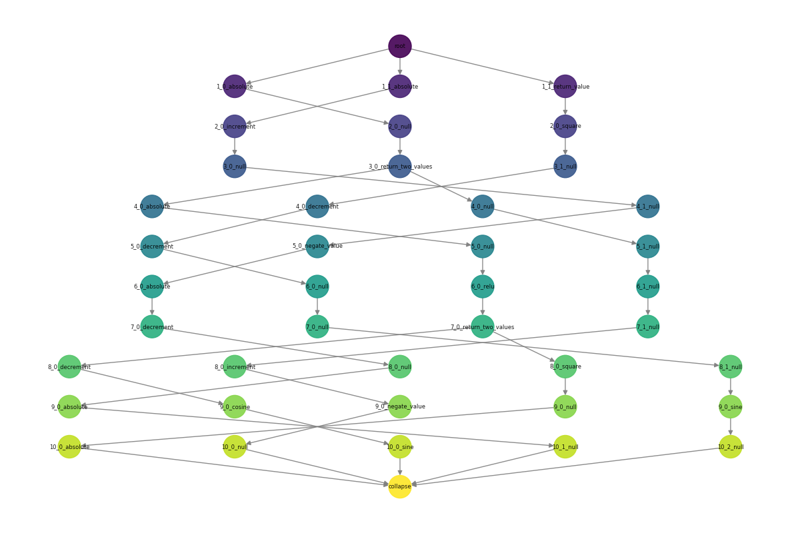
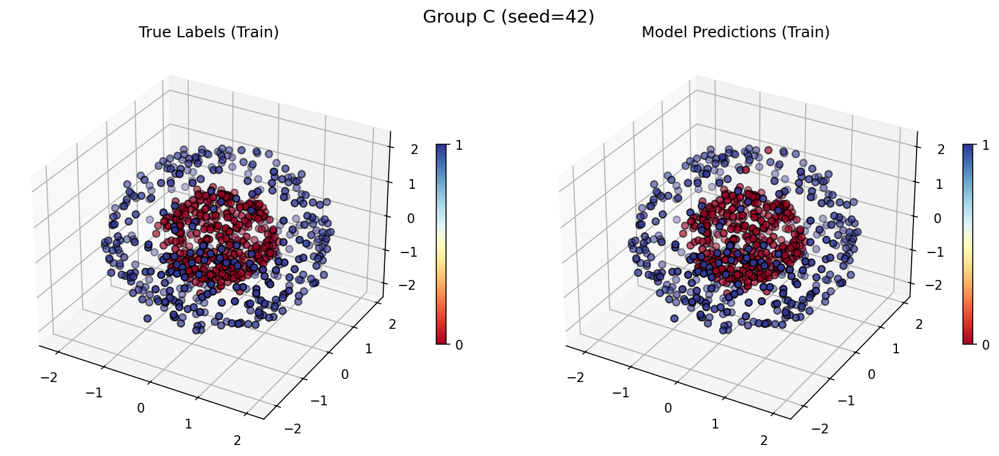
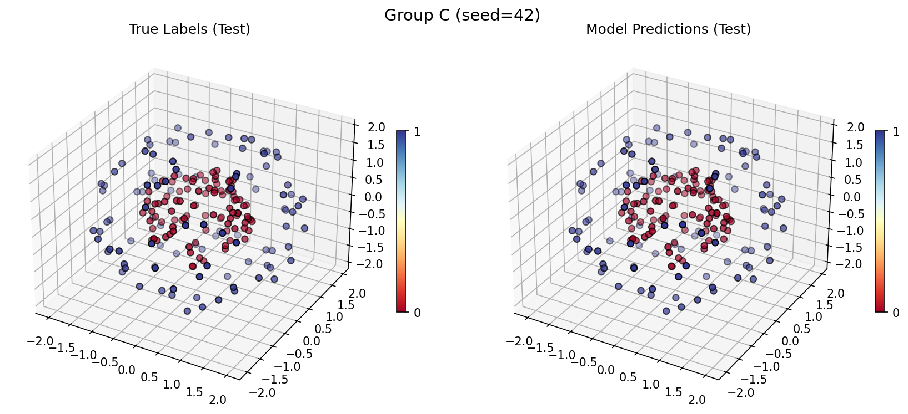

# AdaptoFlux Project Overview (Concise Version)

AdaptoFlux (Pool-Flow Algorithm) is a novel machine learning framework based on "**Method Pool + Graph Structure Optimization**". Its core idea is to dynamically construct and optimize Data Flow Graphs (DFGs) by combining prior knowledge from a method pool, enabling cross-task knowledge sharing and transfer to improve model learning efficiency and adaptability.

Key Features:
- **Method Pool**: Integrates mapping functions (F) and action functions (O), supporting pure computation and state interaction.
- **Dynamic Data Flow Graph (DFG)**: Core structure of `root` → `processing nodes` → `collapse`, supporting modular computation and path composition.
- **GraphEvo Optimization Framework**: Achieves self-evolving graph structures through a four-step closed loop: "diverse initialization → node-wise refinement → modular compression → method pool evolution".
- **Multiple Graph Structure Types**: Native support for Directed Acyclic Graphs (DAGs), graphs with macroscopic loops, and pulse-driven graphs, adapting to different task paradigms.
- **High Interpretability & Flexibility**: Explicit graph structure facilitates understanding and debugging, suitable for symbolic regression, few-shot modeling, game AI, and other scenarios.

> Note: This documentation contains non-real-time information and may include occasional errors.
And it may be rewritten later.

---

# AdaptoFlux

**A Novel Machine Learning Framework for Knowledge Reuse and Continual Learning via Method Pool**

🚧 This project is currently under development (WIP). Features are incomplete and APIs may change.

## Project Overview

AdaptoFlux (Pool-Flow Algorithm) is a novel machine learning framework based on "**Method Pool + Graph Structure Optimization**", designed to address the pain points of traditional models that require "training from scratch" and struggle with knowledge reuse. By introducing a "Method Pool" mechanism, it encapsulates excellent strategies accumulated from historical tasks (such as data preprocessing, feature extraction, decision rules, etc.) into reusable "tools". When facing new tasks, it intelligently selects and combines these tools to dynamically construct optimal data processing pipelines (i.e., Data Flow Graphs).

Unlike gradient-based deep learning or meta-learning, AdaptoFlux's core lies in **dynamic construction and optimization of graph structures**. It is not limited to pure numerical operations but can also integrate actions with side effects (such as environment interaction), giving it natural advantages in complex scenarios like embodied intelligence and game AI. The framework's explicit graph structure also provides strong interpretability, allowing developers to clearly observe the AI's decision-making process.

## Current Progress

- **GraphEvo Framework**: Core logic for "method pool evolution", "diverse initialization", and "node-wise refinement" is complete; "modular compression" module is under development.
- **Graph Structure System**: Currently supports only DAGs.
- **Parallel Acceleration**: Implemented topology-aware dynamic task parallelism for directed graphs, enabling concurrent execution of independent nodes to significantly reduce inference latency under high-load scenarios.
- **Method Pool Management**: Dynamic import and decorator systems are stable.
- **Multimodal & Vectorization Support**: As this project is **memory/data-transfer intensive**, vectorization is not recommended by default. If needed, modify the GP logic or embed vectorization directly within methods.
- **Path Generator Type Matching & Weight System**: Completed type matching and weighting system for path generators.
- **Enhanced Method Pool**:
  - Implemented genetic algorithm filter for method pools to quickly locate optimal subsets from large pools.
  - Added comprehensive input/output type checking and auto-documentation generation for method pool decorators.
  - Supports parallel processing of multiple method pools for different data streams.

## Future Work
- **Add Imitation Capability**: Currently the main missing component; expected to significantly boost practical utility once implemented.
- **Enhance Knowledge Extraction**: Plan to add Bayesian options to knowledge extraction and introduce hyperparameters for current frequency-based extraction.
- **Upgrade LayerGrowTrainer**:
  - **Enhance Acceptance Strategy**: Add more optional algorithms to the `_should_accept` function.
- **Implement Pulse-Driven Graphs**: Develop event-triggered mechanisms for game NPCs and real-time systems.
- **Implement Graphs with Macroscopic Loops**: Complete feedback mechanisms and self-evolution for graphs containing macroscopic loops.
- **Application Exploration**:
  - Create examples demonstrating AdaptoFlux graphs as front-end data preprocessors for MLPs without modifying MLP weights.
  - Integrate AdaptoFlux into game engines to implement NPCs with complex decision logic.
- **Visualization Tools**
- **Bidirectional Collaborative Optimization with Neural Network Algorithms** (likely low priority or deferred; contributions welcome)
- **Hash-Based Optimization**: Plan to add hashing to avoid generating duplicate or redundant graphs during evolution.

# How to Use

1. Create a new conda environment:

```bash
conda create -n AdaptoFlux python=3.12
conda activate AdaptoFlux
```

2. Clone the repository:

```bash
git clone https://github.com/gugugu12138/AdaptoFlux.git
cd AdaptoFlux
```

3. Install dependencies:

```bash
pip install -r requirements.txt
pip install -e .
```

# Modifying the Method Pool

The method pool is the core of AdaptoFlux. You can extend it by modifying `methods.py` or creating new Python files.

Each method must be registered using the `@method_profile` decorator, which defines key metadata such as input/output counts, data types, grouping, and weights.

```python
from ATF.core.adaptoflux import method_profile

@method_profile(
    output_count=1,
    input_types=['scalar'],
    output_types=['scalar'],
    group='math',
    weight=1.0,
    vectorized=True
)
def add_one(a):
    """Add one to the input value"""
    return [a + 1]
```

**Flexible Usage**: AdaptoFlux supports encapsulating any function or model (e.g., MLP, random forest) as a method. To maximize the framework's interpretability advantages, we recommend placing complex models at the end of the graph (e.g., at the `collapse` node), allowing AdaptoFlux's upstream graph structure to serve as an interpretable data preprocessor. Of course, you may also place them anywhere in the graph to achieve more complex knowledge compositions.

# Core Concepts & Architecture

## 1. Method Pool System (Method Pool, Q)

The method pool serves as AdaptoFlux's knowledge base, containing all available operational units. Each method is an embodied behavior that may include computation and state changes.

* **Function Pool (F)**: Pure computational operations with no side effects. Example: `f(x) = x * 2 + 1`.
* **Action Pool (O)**: Operations with side effects, such as modifying state or sending commands. Example: `send_notification("Hello")`.

### Reversibility Classification (for Function Pool F)
| Type | Characteristics | Reverse Inference Capability |
| :--- | :--- | :--- |
| **Fully Reversible (FR)** | Output uniquely determines all inputs. | Fully reversible |
| **Reversible (R)** | Combined with partial input information, complete input can be uniquely reconstructed. | Conditionally reversible |
| **Non-Reversible (N)** | Multiple inputs may map to the same output. | Not reversible |

### Side Effect Classification (for Action Pool O)
| Type | Characteristics | Affects Self | Affects Environment |
| :--- | :--- | :--- | :--- |
| Self-Side-Effect Pool | Modifies only internal state. | Yes | No |
| Environment-Side-Effect Pool | Interacts only with external environment. | No | Yes |
| Dual-Side-Effect Pool | Affects both self and environment. | Yes | Yes |

## 2. Graph System (Data Flow Graph, DFG)

AdaptoFlux's computational model is a generalized data flow graph `G = (V, E)` with three core node types:

* **`root` node**: Graph entry point, receives raw input data.
* **`processing` nodes**: Execute specific methods from the method pool; constitute the main body of the graph.
* **`collapse` node**: Graph exit point, responsible for converting intermediate results into final output format. **Strongly discouraged** to physically merge with `root` node, even when constructing feedback loops. The correct approach is to retain an independent `collapse` node and connect its output edge back to `root`.

### Three Core Graph Structure Types
* **Directed Acyclic Graph (DAG)**: Suitable for static, one-time computation tasks (e.g., batch processing).
* **Graphs with Macroscopic Loops**: Achieve feedback by connecting `collapse` output back to `root` (or intermediate nodes); suitable for online learning and persistent state updates.
* **Pulse-Driven Graphs**: Triggered by external events or signals; suitable for real-time response systems (e.g., game AI).

## 3. Training & Optimization: GraphEvo Framework

AdaptoFlux's core optimization logic is the **GraphEvo framework**, a four-stage self-evolving closed loop:

1. **Diverse Initialization**: Randomly generate multiple initial graph structures; select the best-performing one as the starting point.
2. **Node-wise Refinement**: With fixed graph topology, iteratively attempt to replace processing nodes (ensuring input/output type compatibility), using a greedy strategy that accepts only replacements improving performance.
3. **Method Pool Evolution**: Abstract high-frequency, high-performance subgraph structures discovered during training into new methods, inject them into the method pool for reuse in subsequent tasks.
4. **Modular Compression**: Identify graph portions replaceable by smaller equivalent subgraphs; substitute with high-performance, efficient substructures.

### Method Pool Evolution Mechanism Explained

**Method pool evolution** is the core mechanism enabling GraphEvo's "self-enhancement" capability: it automatically extracts frequently occurring, high-performing subgraph structures from the evolution process into reusable **new computational primitives (i.e., "methods")**, injecting them into the global method pool. This expands the search space and accelerates optimization in subsequent tasks or evolution rounds.

The efficiency and feasibility of this mechanism rely on a key design constraint: **during the "node-wise refinement" phase, the graph topology (node connectivity) remains unchanged**. This means all evolution snapshots share the same graph skeleton, enabling alignment of nodes at "identical logical positions" across rounds without expensive subgraph isomorphism matching.

#### 1. Topological Signature for Node Alignment

Each node is uniquely identified by its **topological signature**, defined as:

```
(layer, in_coords, out_coords)
```

- `layer`: Topological depth of the node in the computation graph;
- `in_coords` / `out_coords`: Sets of data coordinates carried on input/output edges (representing data sources and destinations).

This signature is independent of node ID or specific method, reflecting only the node's structural role in the data flow, thus enabling stable alignment of the same logical position across different snapshots.

#### 2. High-Frequency Subgraph Discovery Pipeline

Based on aligned nodes, the system executes a three-step process to automatically mine high-frequency subgraphs:

1. **Method Frequency Statistics**  
   Iterate through all evolution snapshots, count occurrences of each method at each topological signature position, building a `signature → {method: count}` mapping.

2. **High-Frequency Node Filtering & Connected Component Extraction**  
   Remove nodes with occurrence frequency below threshold; remaining nodes naturally form **connected subgraphs** in the original graph—these are potential reusable modules.

3. **Isomorphism-Based Deduplication (Optional, typically used in multi-task scenarios)**  
   Perform lightweight subgraph isomorphism detection (e.g., WL hashing) on connected subgraphs of identical size; merge structurally identical subgraphs and accumulate their total frequencies to avoid redundancy.

#### 3. High-Confidence Admission Mechanism

Not all high-frequency subgraphs enter the method pool. Only subgraphs meeting at least one of the following criteria are abstracted into new methods:

- **Evolutionary Stability**: Frequently and consistently appearing across multiple evolution rounds in a single task (e.g., ≥80% of rounds contain the subgraph);
- **Cross-Task Generalization**: Independently discovered and reused across multiple related tasks, indicating universal semantic value.

All candidate subgraphs must pass a unified validation process with no exception pathways. This ensures the method pool contains only thoroughly verified, high-quality computational units, preventing overfitting or noise structure contamination of the evolution process.

#### 4. Efficiency Advantage

Thanks to topological invariance, the entire method pool evolution process has time complexity of only $\mathcal{O}(G N T)$ ($G$: number of tasks, $N$: number of nodes, $T$: evolution rounds), far lower than the exponential overhead $\mathcal{O}(G T \cdot N^{k_{\max}})$ of general subgraph mining. This enables GraphEvo to achieve efficient, sustainable self-evolution on large-scale graph structures.

> **Closed-Loop Enhancement Effect**: After new methods are injected, subsequent evolution can directly invoke these high-level abstract modules, enabling exploration of more complex structural combinations and forming a positive cycle of "discovery → abstraction → reuse → re-discovery", continuously improving model performance and architectural expressiveness.

### Core Construction Mechanism: Layered Generate-Evaluate-Rollback

During "diverse initialization" and "node-wise refinement" phases, a "layered generate-evaluate-rollback" mechanism is used to expand or modify graphs:
1. **Generate**: Based on the current graph's output structure, generate candidate new layers or nodes.
2. **Evaluate**: Temporarily add candidate structures to the graph; evaluate performance via a quick forward pass.
3. **Decision & Rollback**: Accept if performance improves; otherwise revert changes and try alternative candidates.

### Role of Genetic Algorithms

Genetic algorithms primarily serve an **auxiliary filtering** role in AdaptoFlux:
* **Method Pool Filtering**: When possessing a large base method pool, genetic algorithms can quickly filter a high-performance sub-pool tailored to the current task.
* **Global Graph Structure Exploration**: As a computationally expensive offline strategy, useful for crossover and mutation among multiple trained model graph structures to explore superior combinations.

## 4. Performance & Theoretical Analysis

### Search Space
AdaptoFlux's search space (all possible graph structures) grows exponentially with method pool size and graph depth. The GraphEvo framework compresses this search space from exponential to engineering-feasible polynomial levels through phased, greedy, and modular strategies.

### Theoretical Maximum Depth
Graph depth is not unlimited. Define method `a`'s input-output ratio as `r_a = inputs(a) / outputs(a)`, and the method pool's expected compression ratio as `H = Σ(W_i * r_i)`. Expansion terminates when data volume at layer `L`, `n_L = n0 * H^L`, falls below the minimum input requirement of any method in the pool. Maximum depth `L_max` can be estimated as:
`L_max = ⌊log(n_min / n0) / log H⌋` (when H > 1)

### Forward Propagation Acceleration

To maximize hardware utilization per inference or training iteration, AdaptoFlux implements a **topology-aware dynamic task parallel acceleration method for directed graphs**.

**Core Idea**: Leverage the DAG property of graph structures to dynamically identify "ready nodes" (nodes whose all predecessors have completed execution) and execute these nodes concurrently using multi-threading.

**Implementation Flow**:
1. **Dependency Analysis & Initialization**: For all non-root nodes, count in-degrees (number of predecessor nodes). Nodes with in-degree 0 (excluding `root`) are added to the ready queue.
2. **Dynamic Scheduling**: Use a thread pool to concurrently execute nodes in the ready queue. Upon completion of a node, decrement the "remaining in-degree" of all its successors; if reduced to 0, add to ready queue.
3. **Synchronization & Aggregation**: After all nodes complete, aggregate outputs according to `collapse` node input edge order to complete single-sample inference.

**Advantages**:
- **Low Latency**: Significant reduction in single forward pass time through concurrent execution of independent nodes.
- **Strong Generality**: Applicable to any DAG computation graph without pre-defined stage partitioning.
- **Resource Adaptability**: Configurable thread count adapts to different hardware environments.

**Performance Bottlenecks**:
Acceleration effectiveness is limited by the graph's **critical path length** (longest dependency chain) and **imbalance in node computational load**. Future work will explore smarter node scheduling strategies and load balancing mechanisms.

---

## Application Examples

  
*Figure 1: Visualization of AdaptoFlux model structure (DFG) trained on the spherical shell problem*

  
*Figure 2: Model decision boundaries or path activation on training set*

  
*Figure 3: Model generalization performance and decision paths on test set*

